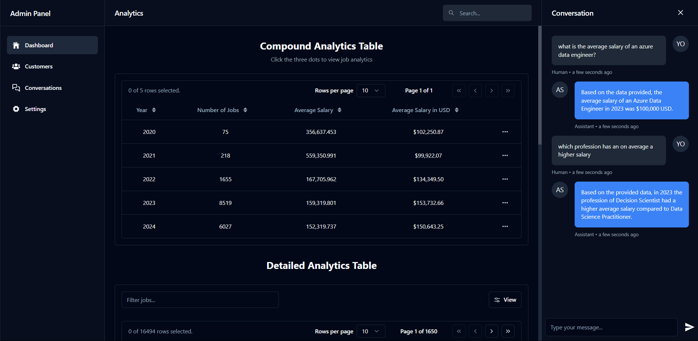

# Demo



- A basic analytics dashboard to display the data.
- A visualization graph to show the data.
- A llm based rag enabled ai chatbot to answer the queries.

# Setup

```bash
$ git clone https://github.com/FallenDeity/rag-analytics
$ cd rag-analytics
$ npm install
```

# Build

```bash
$ npm run build
```

Internally calls for next to build the project.

# Test

```bash
$ npm run test
```

Internally calls for mocha to run the tests.

# Run

```bash
$ npm run dev
```

Internally calls for next to run the project in development mode.

# Others

- `npm run lint` - Runs eslint on the project.
- `npm run lint:fix` - Runs eslint on the project and fixes the errors.
- `npm run prettier` - Runs prettier on the project.
- `npm run prettier:fix` - Runs prettier on the project and fixes the errors.

> **Note**  
> Few more commands are available in `package.json` under `scripts` section.
